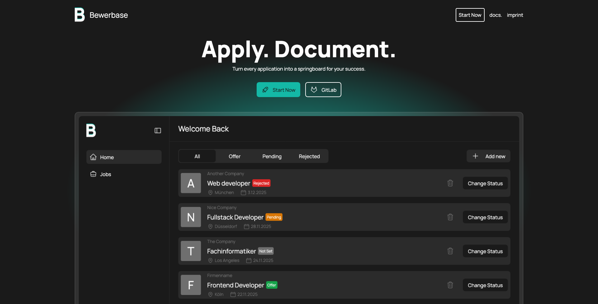

# Bewerbase - WIP

`cd frontend`

`
yarn install
`
und
`
yarn dev
`

Verwendete [Arbeitsamt API](https://jobsuche.api.bund.dev/)

[https://bewerbase-60317a.gitlab.io/
](https://micronetic.github.io/bewerbase)
 

